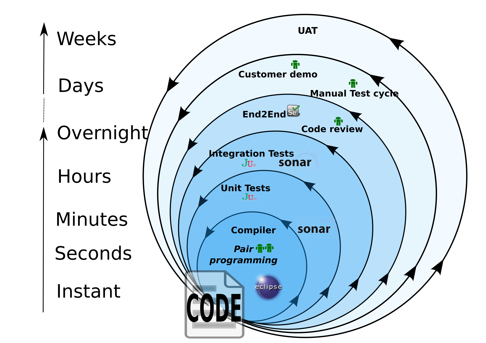

## Build fast feedback loops

Good code is all about getting good and timely feedback. The sooner you find out something is wrong the easier it is to fix.

Working on a legacy project where the only way to discover if a code change is good is to deploy it to a dev/test/qa environment is frustrating and demoralising.

Make sure your project has a well designed development workflow - the effort of setting this up will be repaid many times over.

Ideally all feedback would be instantaneous, but in practice it is either impractical or impossible to get all feedback this way. 

Instead software development is organised as nested levels of feedback as shown below.

