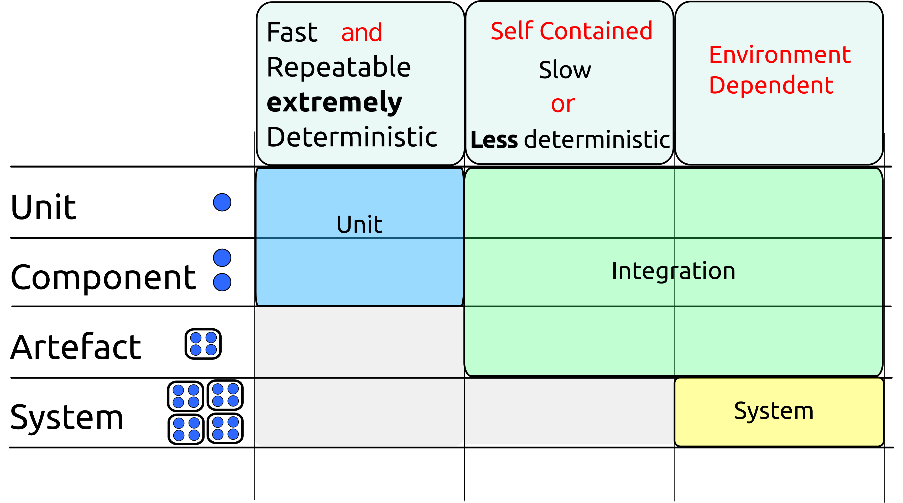
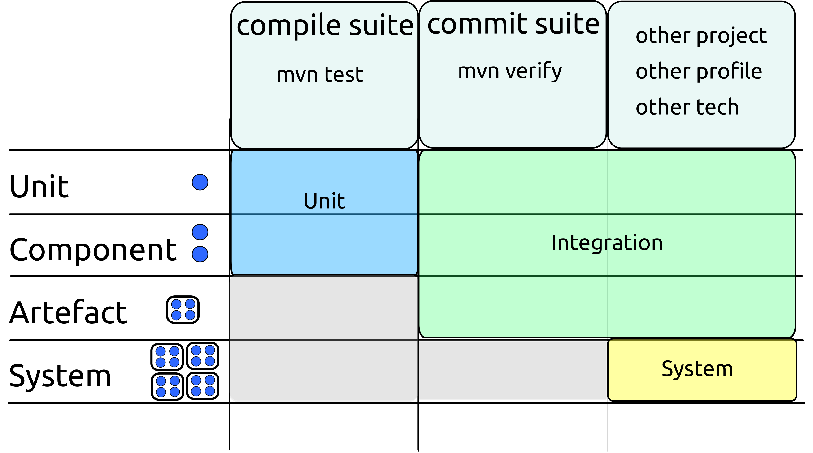

## Agree the Language You Use When Discussing Tests

### The Testing Pyramid

Unfortunately, the language of testing is heavily overloaded, with different communities referring to different things by the same names.

The testing pyramid is a widely recognized diagram of how testing should be approached. 

It shows large numbers of unit tests at the bottom, with a smaller number of integration tests above them and a yet smaller number of system tests at the peak. Often, some clouds of manual testing are added at the top.

This diagram has probably been drawn thousands of times. Although unit tests will appear at the bottom of each version, the words used at the other levels will vary wildly.

Even when the same words are used the meanings attached to them might be different. 

Although people might nod when you discuss "unit tests", "integration tests", "system tests", "end 2 end tests", "service tests", there is no guarantee that they are thinking of the same thing as you.

Depending on who you speak to, a "unit test" might be anything from a word document full of instructions, "any test written by a programmer", through to various formal (but by no means authoritative) definitions that appeared in text books.

The number of possible meanings of "integration test" is even greater.

### Unit Tests

A fairly tight definition of unit test now in common use in the Java community. We recommend that you and your team use this definition. 

To be a unit test, a test must be:

* Fast (milliseconds or less)
* Isolated (test only one unit)
* Repeatable (able to be run millions of times on any machine with the same result)
* Self verifying (either passes or fails)
* Timely (written first)

Note: Although writing your tests first is often a very good idea, a test that meets the other criteria is still a unit test regardless of when it was written. 

When we talk about "unit" testing, what constitutes a *unit* isn't necessarily that obvious.

A somewhat circular definition is that a *unit* is the smallest thing makes sense to test independently. 

It will often be a single class, but this is not necessarily the case. It may make sense to treat a group of classes as a unit (particularly if most of them are non-public) or occasionally even a method.

If we accept that a *unit* is a small thing, and that we'll know it when we see it, then we can see that the criteria for being a unit test largely matches the criteria we put forward for the compile suite. 

The only difference is that the compile suite does not care about isolation.

If we choose to write a test that tests two (or more) *units* in tandem, it still belongs in the compile suite if it meets the other criteria.

### System Tests

System tests are also fairly well-defined. They are tests that exercise the overall system - i.e all your code and all the code it interacts with in a realistic environment.

### Integration Tests

Integration tests are harder to define. They occupy the large space of everything that doesn't fit the unit or system tests definitions.

The two following diagrams show how this terminology fits into our world of test suites. 

This document will use the terminology *unit test*, *Integration test* and *System test* as shown in these diagrams. 

For clarity, it will sometimes state exactly what is being tested when discussing integration tests - e.g "test via the REST API of the war file running in Tomcat". 

Although it is tedious, this long-hand terminology is clear. It is recommended that you use it when discussing testing across teams. Within your own team it is likely you will develop a shorter language you all understand.

This maps to our suites as shown below:

